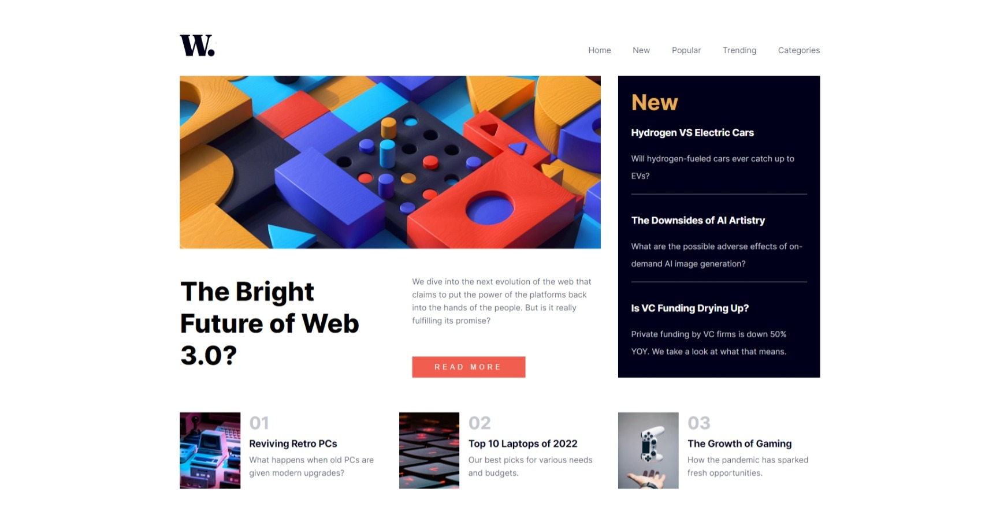

# Frontend Mentor - News Homepage Main

This is a solution to the [News Homepage Main challenge on Frontend Mentor](https://www.frontendmentor.io/challenges/news-homepage-H6SWTa1MFl). Frontend Mentor challenges help you improve your coding skills by building realistic projects.

## Table of contents

- [Overview](#overview)
  - [Screenshot](#screenshot)
  - [Links](#links)
- [My process](#my-process)
  - [Built with](#built-with)
  - [What I learned](#what-i-learned)
  - [Continued development](#continued-development)
  - [Useful resources](#useful-resources)
- [Author](#author)


## Overview

### Screenshot




### Links

- Solution URL: [git repo](https://github.com/sayeedk06/FM-newsHomepageMain)
- Live Site URL: [live site URL](https://sayeedk06.github.io/FM-newsHomepageMain/)

## My process

### Built with

- HTML5
- CSS

### What I learned

Learned to use grid properly, making responsive design, using srcset for responsive image and creating the hamburger navigation for mobil view. Also started taking note of making site better for screen readers.

Example of hamburger navigation solution
```html
  <header>
    <div class="logo">
      
    </div>
    <nav>
      <button class="hamburgerMenu-toggle" aria-controls="nav-list" aria-expanded="false"><span class="sr-only">menu</span></button>
      <ul id='nav-list' data-visible="false" class="nav-list">
        <li class="nav-elements">Home</li>
        <li class="nav-elements">New</li>
        <li class="nav-elements">Popular</li>
        <li class="nav-elements">Trending</li>
        <li class="nav-elements">Categories</li>
      </ul>
    </nav>
  </header>
```

```css
header {
    display: flex;
    padding-top: 4rem;
    padding-bottom: 2rem;

}
nav {
    width: 100%;
}
.nav-list{
    display: flex;
    gap: 2.5rem;
    list-style-type: none;
    color: var(--bg-neutral-400);
    justify-content:flex-end
    
}
.nav-elements:hover {
    color: var(--bg-accent);
    cursor: pointer;
}
```


### Continued development

Want to get more comfortable using responsive image, animation and responsive navbar

### Useful resources

- [Example resource 1](https://www.youtube.com/watch?v=rg7Fvvl3taU&t=1344s) - This helped with understanding grid
- [Example resource 2](https://www.w3schools.com/css/css_grid.asp) - Cheatsheat for grid in w3School

## Author

- Website - [Sayeed Md Shaiban](https://sayeedshaiban.fyi/)
- Frontend Mentor - [@sayeedk06](https://www.frontendmentor.io/profile/sayeedk06)
- Twitter - [@evrydaywannabe](https://twitter.com/evrydaywannabe)


